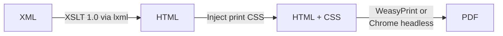

# xml-xslt-to-pdf

[日本語版 README はこちら / Japanese README](./README.md)

This repository contains a helper script `convert_xmls.py` to render the supplied XML files (which reference XSL stylesheets via `xml-stylesheet` processing instructions) into human‑readable PDF documents.

> IMPORTANT: Before running `convert_xmls.py` you MUST install dependencies via `bash setup_env.sh` (or manually create a venv and `pip install -r requirements.txt`). Running the script without installing will raise the `ModuleNotFoundError: No module named 'lxml'` error.

## Flow



## Features
- Automatically discovers the XSLT from the `<?xml-stylesheet ...?>` processing instruction.
- Caches compiled XSLT to speed up multiple XMLs using the same stylesheet.
- Heuristic page sizing: if the generated HTML appears very wide (many `<col>` or large `colspan`), selects `A3 landscape`; otherwise defaults to `A4 portrait`.
- You can override page size and orientation manually.
- Injects print CSS (page size, margins, basic font family including Japanese fonts assumptions).
- Per‑XML PDF output (same basename, `.pdf`).
- Optional Chrome/Chromium engine if you prefer a full browser layout engine.
- Cross‑platform (macOS / Windows / Linux) as long as dependencies are installed.

## Prerequisites
Python 3.9+ recommended.

### Create & activate virtual environment (macOS / Linux / WSL)
```bash
python3 -m venv .venv
source .venv/bin/activate
pip install -U pip
pip install -r requirements.txt
```

### Windows (PowerShell)
```powershell
python -m venv .venv
.venv\Scripts\Activate.ps1
pip install -U pip
pip install -r requirements.txt
```

> If WeasyPrint wheels pull in `pango`, `cairo`, etc. and your platform lacks them, install platform packages (e.g., on macOS via Homebrew: `brew install pango cairo gobject-introspection libffi` before installing WeasyPrint). Recent wheels often bundle what you need, so try pip first.

### (Optional) Chrome / Chromium
If using `--engine=chrome`, ensure Chrome/Chromium is installed and available in PATH. You can provide an explicit binary path with `--chrome-path`.

## Usage
From the directory containing the XML/XSL files:
```bash
python convert_xmls.py
```
This scans the current directory and converts every `*.xml` that has an `xml-stylesheet` PI pointing to an existing `.xsl`/`.xslt` file.

### Common options
```bash
python convert_xmls.py             # default: weasyprint engine
python convert_xmls.py --engine=chrome                      # use headless Chrome
python convert_xmls.py --engine=chrome --chrome-path "/Applications/Google Chrome.app/Contents/MacOS/Google Chrome"
python convert_xmls.py some/file1.xml other/dir             # explicit paths
python convert_xmls.py --out-dir output_pdfs                # write PDFs elsewhere
python convert_xmls.py --force-page-size A3 --force-orientation landscape
python convert_xmls.py --margin 8mm
```

Each processed XML logs a line:
```
[OK] 202410170211329451.xml -> 202410170211329451.pdf (A4 portrait)
```

## Page Size Heuristics
The script inspects the generated HTML:
- Calculates actual table width from `<col>` tag `width` attributes (including `span` attribute)
- If total width ≥ 1200px → `A3 landscape`
- If total width ≥ 800px → `A4 landscape`
- Otherwise → `A4 portrait`
- Falls back to counting `<col>` tags (≥30) or large `colspan` (≥25) if no width attributes found

Override with `--force-page-size` / `--force-orientation` if you need a different result.

## Fonts
The injected CSS sets a font stack including `Yu Mincho`, `Hiragino Mincho ProN`, `Noto Serif CJK JP`, serif. Ensure at least one Japanese font is installed to render characters correctly. If not, install (e.g., Noto fonts) and re-run.

## Chrome Engine Notes
When using `--engine=chrome`, the script writes a temporary HTML file then invokes Chrome with `--headless --print-to-pdf`. Margins and page size are controlled by injected CSS but Chrome sometimes enforces its own defaults; test both engines if layout precision matters.

## Troubleshooting
| Issue                                  | Cause                               | Fix                                               |
| -------------------------------------- | ----------------------------------- | ------------------------------------------------- |
| RuntimeError: WeasyPrint not installed | Dependencies missing                | `pip install -r requirements.txt`                 |
| Missing Japanese glyphs                | Font not installed                  | Install a CJK font (e.g., Noto Serif CJK JP)      |
| Stylesheet not found                   | `href` in PI points to missing file | Ensure XSL file present in same dir               |
| Wrong page size                        | Heuristic mis-detected              | Use `--force-page-size` and `--force-orientation` |

## Extending
- Merge PDFs: add PyPDF2 logic (already in requirements) if needed later.
- Add hash/signature verification for referenced files if integrity is required.
- Embed CSVs: parse and append tables to HTML prior to PDF rendering.

## License
Internal utility script – adapt as needed.
