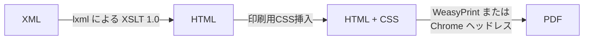

# xml-xslt-to-pdf

[English README](./README.en.md)

このリポジトリには、XMLファイル（`xml-stylesheet`処理命令でXSLスタイルシートを参照）を人間が読めるPDF文書にレンダリングするヘルパースクリプト `convert_xmls.py` が含まれています。

> 重要: `convert_xmls.py` を実行する前に、必ず `bash setup_env.sh` で依存関係をインストールしてください（または手動で venv を作成して `pip install -r requirements.txt` を実行してください）。インストールせずにスクリプトを実行すると、`ModuleNotFoundError: No module named 'lxml'` エラーが発生します。

## 処理の流れ



## 主な機能
- **ZIP ファイル対応**: ZIPファイルを入力として受け付け、内部のXML/XSLファイルを処理してPDFを生成
  - 日本語ファイル名の適切な処理（UTF-8/Shift-JISエンコーディングを自動検出）
- `<?xml-stylesheet ...?>` 処理命令から XSLT を自動検出
- 複数のXMLが同じスタイルシートを使用する場合、コンパイル済みXSLTをキャッシュして高速化
- ページサイズの自動判定: 生成されたHTMLが非常に幅広い（多数の `<col>` または大きな `colspan`）場合は `A3 横向き` を選択、それ以外は `A4 縦向き` がデフォルト
- ページサイズと向きを手動で上書き可能
- 印刷用CSSの挿入（ページサイズ、余白、日本語フォントを含む基本的なフォントファミリー）
- XMLごとにPDFを出力（ベース名は同じで、拡張子は `.pdf`）
- フルブラウザレイアウトエンジンを希望する場合、オプションで Chrome/Chromium エンジンを使用可能
- クロスプラットフォーム対応（macOS / Windows / Linux）、依存関係がインストールされていれば動作

## 前提条件
Python 3.9+ を推奨。

### 仮想環境の作成とアクティブ化（macOS / Linux / WSL）
```bash
python3 -m venv .venv
source .venv/bin/activate
pip install -U pip
pip install -r requirements.txt
```

### Windows（PowerShell）
```powershell
python -m venv .venv
.venv\Scripts\Activate.ps1
pip install -U pip
pip install -r requirements.txt
```

> WeasyPrintのホイールが `pango`、`cairo` などを必要とし、お使いのプラットフォームにそれらがない場合は、プラットフォーム固有のパッケージをインストールしてください（例: macOSではHomebrewを使用: `brew install pango cairo gobject-introspection libffi`）。最近のホイールは必要なものをバンドルしていることが多いので、まずpipを試してみてください。

### （オプション）Chrome / Chromium
`--engine=chrome` を使用する場合は、Chrome/Chromium がインストールされていて、PATH で利用可能であることを確認してください。`--chrome-path` で明示的なバイナリパスを指定することもできます。

## 使用方法

### 基本的な使い方
XML/XSLファイルを含むディレクトリから:
```bash
python convert_xmls.py
```
これにより、カレントディレクトリをスキャンして、既存の `.xsl`/`.xslt` ファイルを指す `xml-stylesheet` 処理命令を持つすべての `*.xml` を変換します。

### ZIP ファイルの処理
XMLとXSLファイルを含むZIPファイルを直接処理できます:
```bash
python convert_xmls.py archive.zip
```
- ZIPファイル内のXMLとXSLファイルを自動的に検出
- 一時ディレクトリに展開して処理
- PDFはカレントディレクトリに出力（`--out-dir` で変更可能）

### よく使うオプション
```bash
python convert_xmls.py             # デフォルト: weasyprint エンジン
python convert_xmls.py archive.zip                          # ZIPファイルを処理
python convert_xmls.py archive.zip --out-dir ./pdfs         # ZIPからPDFを指定ディレクトリに出力
python convert_xmls.py --engine=chrome                      # ヘッドレス Chrome を使用
python convert_xmls.py --engine=chrome --chrome-path "/Applications/Google Chrome.app/Contents/MacOS/Google Chrome"
python convert_xmls.py some/file1.xml other/dir             # 明示的なパス指定
python convert_xmls.py --out-dir output_pdfs                # PDFを別の場所に出力
python convert_xmls.py --force-page-size A3 --force-orientation landscape
python convert_xmls.py --margin 8mm
```

処理された各XMLについて、次のような行がログに出力されます:
```
[OK] 202410170211329451.xml -> 202410170211329451.pdf (A4 portrait)
```

## ページサイズの判定ロジック
スクリプトは生成されたHTMLを検査します:
- `<col>` タグの `width` 属性から実際のテーブル幅を計算（`span` 属性も考慮）
- 合計幅が1200px以上の場合 → `A3 横向き`
- 合計幅が800px以上の場合 → `A4 横向き`
- それ以外 → `A4 縦向き`
- width属性が見つからない場合は、`<col>` タグの数（30個以上）や大きな `colspan`（25以上）で判定

異なる結果が必要な場合は、`--force-page-size` / `--force-orientation` で上書きしてください。

## フォント
挿入されるCSSは、`Yu Mincho`、`Hiragino Mincho ProN`、`Noto Serif CJK JP`、serif というフォントスタックを設定します。日本語文字を正しくレンダリングするために、少なくとも1つの日本語フォントがインストールされていることを確認してください。インストールされていない場合は、（例: Notoフォント）をインストールして再実行してください。

## Chromeエンジンに関する注意事項
`--engine=chrome` を使用すると、スクリプトは一時的なHTMLファイルを書き込み、`--headless --print-to-pdf` でChromeを呼び出します。余白とページサイズは挿入されたCSSで制御されますが、Chromeは独自のデフォルト値を強制することがあります。レイアウトの精度が重要な場合は、両方のエンジンをテストしてください。

## トラブルシューティング
| 問題                                   | 原因                                           | 解決方法                                            |
| -------------------------------------- | ---------------------------------------------- | --------------------------------------------------- |
| RuntimeError: WeasyPrint not installed | 依存関係が不足                                 | `pip install -r requirements.txt`                   |
| 日本語グリフが表示されない             | フォントがインストールされていない             | CJKフォント（例: Noto Serif CJK JP）をインストール  |
| Stylesheet not found                   | PI内の `href` が存在しないファイルを指している | XSLファイルが同じディレクトリにあることを確認       |
| 誤ったページサイズ                     | ヒューリスティックが誤検出                     | `--force-page-size` と `--force-orientation` を使用 |

## 拡張機能
- PDFのマージ: 後で必要になった場合はPyPDF2ロジックを追加（既にrequirementsに含まれています）
- 参照ファイルの整合性が必要な場合は、ハッシュ/署名検証を追加
- CSVの埋め込み: PDFレンダリング前にCSVを解析してHTMLにテーブルとして追加

## ライセンス
内部ユーティリティスクリプト – 必要に応じて適応してください。
